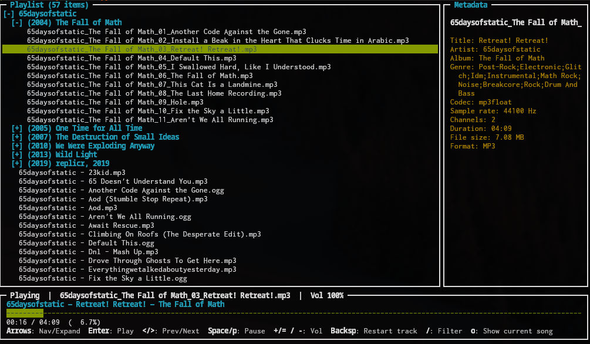

# 🌳 treemp 🌳

### Ncurses/Python tree-navigation music player.  

Definitely works on Linux, probably also works on Mac OS X and maybe even Windows too.



Requires Python 3, and pip libraries `av`, `soundcard`, `numpy`, and `mutagen`.  

```
git clone git@github.com:djvs/treemp.git
cd treemp 
pip install av soundcard numpy mutagen
sudo mv treemp.py /usr/bin/treemp 
sudo chmod +x /usr/local/bin/treemp
```

This is meant to be a lightweight, efficient, low resource and highly stable Python wrapper over established libraries for its core tasks - decoding media, piping it to an audio backend, and having a clean CLI UI that basically never crashes - and most importantly, has tree navigation for music stored in an actual directory structure.  Originally I used VLC for these tasks, but its Wayland compatibility on Linux has been terrible, resulting in frequent crashes.


Small PRs are welcome. Feature requests or huge overhauls, not so much.
